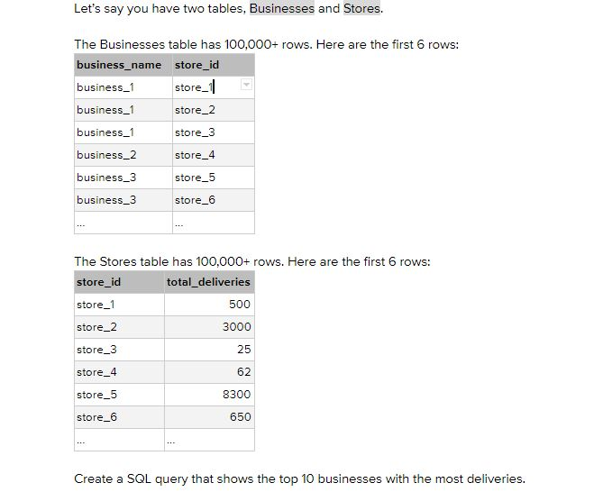
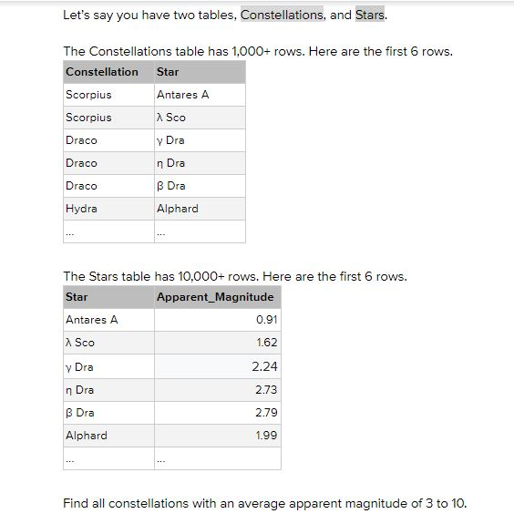
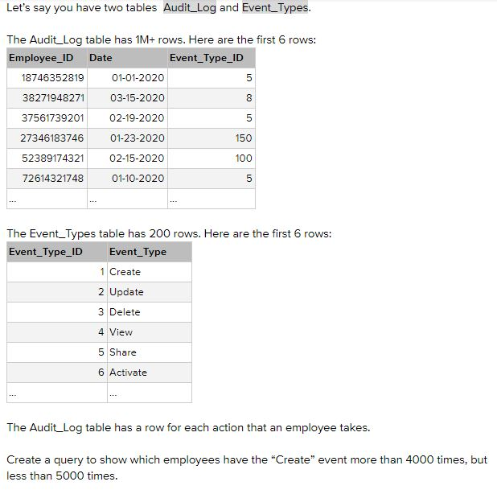

## Question 1
---

### CODE :
```
CREATE TABLE BUSINESS (
    business_name varchar(255),
    store_id varchar(255),
    PRIMARY KEY (store_id)
);

CREATE TABLE STORES (
    store_id varchar(255),
    total_deliveries int,
    PRIMARY KEY (store_id)
);


INSERT INTO BUSINESS
VALUES 
("business_1", "store_1"),
("business_1", "store_2"),
("business_1", "store_3"),
("business_2", "store_4"),
("business_3", "store_5"),
("business_3", "store_6");


INSERT INTO STORES
VALUES 
("store_1", 500),
( "store_2", 3000),
("store_3", 25),
( "store_4", 62),
("store_5", 8300),
("store_6", 650);


SELECT B.business_name, SUM(S.total_deliveries) as sum_deliveries
FROM BUSINESS B
INNER JOIN STORES S
ON B.store_id = S.store_id
GROUP BY B.business_name
ORDER BY sum_deliveries desc
LIMIT 5;

```
## Question 2
---


```

CREATE TABLE Constellations (
    Constellation varchar(255),
    Star varchar(255),
    PRIMARY KEY (Star)
);

CREATE TABLE Stars (
    Star varchar(255),
    Apparent_Magnitude float,
    PRIMARY KEY (Star)
);


INSERT INTO Constellations
VALUES 
("Scorpius", "Antares A"),
("Scorpius", "bow B"),
("Draco", "cow C"),
("Draco", "Dog D"),
("Draco", "Eli E"),
("Hydra", "fang");


INSERT INTO Stars
VALUES 
("Antares A", 0.91),
( "bow B", 1.62),
("cow C", 2.24),
( "Dog D", 2.73),
("Eli E", 2.79),
("fang", 1.99);


SELECT C.Constellation, AVG(S.Apparent_Magnitude) as avg_apparent_magnitude
FROM Constellations C
INNER JOIN Stars S
ON C.Star = S.Star
GROUP BY C.Constellation
HAVING avg_apparent_magnitude >= 0 AND avg_apparent_magnitude <= 10;
```

## Question 3



```

CREATE TABLE Audit_Log (
    Employee_ID int,
    Date date,
    Event_Type_ID int
);

CREATE TABLE Event_Types (
    Event_Type_ID int,
    Event_Type varchar(255)
);


INSERT INTO Audit_Log
VALUES 
(111, 01-01-2020, 5),
(112, 03-15-2020, 8),
(111, 02-19-2020, 5),
(114, 01-23-2020, 150),
(115, 02-15-2020, 100),
(111, 01-10-2020, 5);


INSERT INTO Event_Types
VALUES 
(1, "Create"),
(2, "Update"),
(3, "Delete"),
(4, "View"),
(5, "Share"),
(6, "Activate");


SELECT Employee_ID
FROM Audit_Log
GROUP BY Employee_ID
Having Event_Type_ID = 
(
SELECT Event_Type_ID
FROM Event_Types
WHERE Event_Type = "Share"
)
AND COUNT(Event_Type_ID) >= 1;
```


## Question 5

**SQL Phone Interview Question**

1. On a scale of 1 to 10 how would you rate your SQL Abilities?

Example Answer: I would currently rate myself an 8/10.

 

2. Can you describe how you currently or have used SQL in the past?

Example Answer: I currently use it in my role to query tables and views to analyze data. I also use it to create Stored Procedures to automatically send my reports to clients. I work with our programming team to help optimize scripts in SQL. Lastly, I use SQL to help with acquiring data, cleaning data, and modeling it for use in our products.

 

3. Have you ever used a Cloud based platform? And if so, how have you used it?

Example Answer: I currently use Azure, but I have use AWS in the past. I use Azure DataLake to store large amounts of data. I also use Databricks to automatically ingest flat files from clients.

 

**Broad Questions**

1. What was your most challenging data analyst project?

Example Answer: In March we were submitting data for MIPS for one of your largest clients. We were on a very tight deadline and one of our contract workers who worked in Canada was not answering emails or calls. We needed him to help analyze a very large data set for several things and when we couldn’t reach him we had to figure out a solution. We had a very narrow deadline and I ended up working with our Director of Data Analytics in an all night session to get the analytics to our client to prepare for the submission of their MIPS data. We successfully handled the project and submitted their data on time. 

 

2. Describe a time when you had to work with a group on a Data Analyst Project?

Example Answer: We were working with a client in North Carolina who needed a Gap Analysis done of their current on-prem system compared to their new Cloud based system. We had to work with a small team in North Carolina as well as our team at our company to get access to their data from both locations. The team lead on our side gave us our tasks and we worked for several weeks to give them an in-depth analysis of their data.

 

3. Are you familiar with any clouds platforms?

Example Answer: I have a lot of experience with Azure and some experience with AWS. I have taken a few courses in GCP, but I have not worked with it in a professional setting.

 

4. Describe a time when you’ve made a mistake on a project and how you handled it.

Example Answer: I was working with a client to get them an analysis of some data they sent us. At the time we had 2 servers with almost the same configurations. One was a historical server and the other an active server that was getting a daily feed. I spent a few days on the analysis and sent it to the client and they emailed back saying the numbers looked off. I quickly realized that I had accidentally done my analysis on the historical server and not the updated server. I quickly apologized to the client and said I would get him an analysis with the correct data. Luckily, I had a good relationship with the client and he said it was all good and to get him a new analysis of the correct data as soon as I could. I sent that to him shortly after that and was still able to meet the deadline that we had set.

 

**SQL In-Person Interview Question**

**Easy**

1. What is the difference between a table and a view? 

Example Answer: A table is a preliminary storage for storing data in a relational database management system. A view is a virtual table and is a subset of a tables or tables and typically does not take up as much space as a table.

 

2. How would you write a query that would only select unique records in a column? 

SELECT DISTINCT(Column)

FROM Table

 

3. I have 2 columns called Drug_Name and Drug_Price. Each drug has different prices depending on where it is being sold. I want to see the drug name with the highest price it is being sold at. How would you write that query?

Answer:

SELECT Drug_Name, MAX(Drug_Price)

FROM table

GROUP BY Drug_Name

 

4. What does GROUP BY (Statement) do in a Query? And why would you use it?

Example Answer: The Group By statement groups rows that have the same value into summary rows and are typically use with aggregate functions to look at specific data in the dataset in a more organized manner. 

5. I have a column called Drug_Name. I want to look at Drugs that start with “Aspirin”. How would you only return drug names that start with Aspirin? (Answer use the “Like” Operator”)

Answer: 

SELECT Drug_Name

FROM table

WHERE Drug_Name LIKE ‘Aspirin%’

 

**Intermediate**

1. What is a subquery and can you describe how you would write that?

Example Answer: A Subquery is a query nested inside of a larger query.

I would write it like this:

SELECT *

FROM Table

WHERE UserID in 

(SELECT userID 

FROM Table2)

 

2. What is an join and what data would be returned if you use an inner join?

Example Answer:

A Join combines two tables into a single output. An Inner Join will return data that is intersects (or is common) between both tables. For example: if Table 1 has a,b, and c and Table 2 has b and c. Only b and c will be returned because a is only in Table 1.

 

3. What is the difference between an inner and outer join?

Example Answer: An Inner Join will return data that is intersects (or is common) between both tables whereas an outer join will return all of one table and the intersection of both tables or will return everything from both tables whether they intersect or not. 

 

4. What is a CASE statement? And how would you write it?

Example Answer: The CASE statement goes through conditions and returns a value when the first condition is met (like an IF-THEN-ELSE statement). So, once a condition is true, it will stop reading and return the result. If no conditions are true, it returns the value in the ELSE clause. 

It can be written like this:

SELECT CASE

​        WHEN column > 2 THEN ‘Output1’

​        ELSE ‘Output2’

END

FROM Table

 

5. What is a UNION (Operator)? And how would you write it?

Example Answer: The UNION operator is used to combine the result-set of two or more SELECT statements.

It can be written like this:

SELECT Column1, Column2

FROM Table1

UNION

SELECT Column1, Column2

FROM Table2

 

6. I have 2 tables. One table contains patient information and the other contains Drug information. In the Patient table we have PatientID, First_Name, Last_Name, and Disease. In the Drug table we have PatientID, Dispensed_drug, Date_dispensed. Can you create a Query to return the PatientID, Disease, and Dispensed_drug?

Answer:

SELECT PatientID, Disease, Dispensed_Drug

FROM Patient

JOIN Drug

ON Patient.PatientID = Drug.PatientID

 

**Difficult**

1. What are sys tables or System tables?

Example Answer: sys.tables is a system table and is used for maintaining information on tables in a database. For every table added to the database, a record is created in the sys.tables table. There is only one record for each table and it contains information such as table name, object id of table, created date, modified date, etc. Object ID is unique and we will use it to join this table with other system tables (sys.columns) in order to fetch column details.

 

2. What does the ISNULL function do?

Example Answer: ISNULL returns the specified value IF the expression is NULL, otherwise return the expression.

 

3. What is a temp table and how do you use it?

Example Answer: A temporary table in SQL Server, as the name suggests, is a database table that exists temporarily on the database server. A temporary table stores a subset of data from a normal table for a certain period of time.

You can use it by specifying the Table Name, Column Names, and Data Types of you Temp Table and then storing data into that table. You can then query the temp table to look at that data.

 

 

 

 

